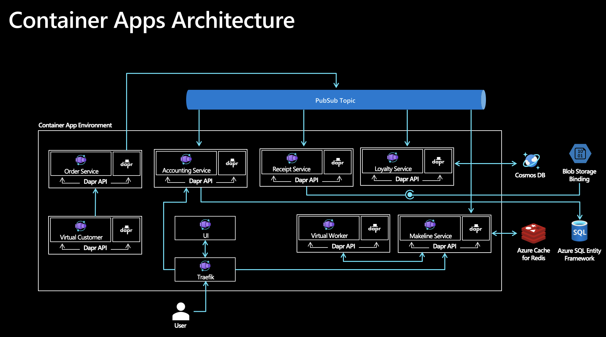

# Red Dog Demo: Azure Container Apps Deployment

## Background

This repository leverages the [Reddog codebase](https://github.com/Azure/reddog-code) and was created to help users deploy a comprehensive, microservice-based sample application to Azure Container Apps. 

[Azure Container Apps](https://azure.microsoft.com/en-us/services/container-apps/) (Preview) is a fully managed serverless container offering for building and deploying modern apps at scale. It enables developers to deploy containerized apps without managing complex infrastructure like kubernetes clusters. It leverages Azure Container Apps integration with a managed version of the [Distributed Application Runtime (Dapr)](https://dapr.io/). Dapr is an open source project that helps developers with the inherent challenges presented by distributed applications, such as state management and service invocation. Container Apps also provides a managed version of [Kubernetes Event Driven Autoscaling (KEDA)](https://keda.sh/). KEDA allows your containers to autoscale based on incoming events from external services such Azure Service Bus and Redis.

To explore how Azure Container Apps compares to other container hosting options in Azure, see [Comparing Container Apps with other Azure container options](/azure/container-apps/compare-options). Note that Azure Container Apps is currently in Public Preview and so not recommended for production workloads. 

## Architecture

The architecture is comprised of a single Container Apps Environment that hosts ten .NET Core microservice applications. The .NET Core Dapr SDK is used to integrate with Azure resources through PubSub, State and Binding building blocks and while Dapr typically provides flexibility around the component implementations, this solution is opinionated. The services also make use of KEDA scale rules to allow for scaling based on event triggers as well as scale to zero scenarios.



This repository leverages bicep templates in order to execute the deployment of the application and the supporting Azure Infrastructure. Bicep is a Domain Specific Language (DSL) for deploying Azure resources declaratively and provides a transparent abstraction over Azure Resource Manager (ARM) and ARM templates.

### Container Apps 

For details on the microservices and their functionality, visit the Reddog [codebase repo](https://github.com/Azure/reddog-code). Each Container Apps deployment configuration is described below including its associated Dapr components and KEDA scale rules. Please note this repository contains an additional component that is needed to get the solution up and running on Container Apps.

#### Traefik 
Traefik is a leading reverse proxy and load balancer that integrates with your existing infrastructure components and configures itself automatically. The UI container app has the ability to route to backend container apps through the managed ingress capabilities (Envoy) built into the platform. For this solution, we chose to leverage Traefik's dynamic configuration feature to provide a single point of ingress and a way to invoke internal, back-end apis using the [rest-samples](./rest-samples). The alternative approach would be to enable external ingress on multiple container apps in the environment. Traefik is not necessary for all Container Apps ingress configurations but enables sub-domain routing capabilities which are not supported in the service today, as all container apps in the environment are deployed to a single domain.


| Service          | Ingress |  Dapr Component(s) | KEDA Scale Rule(s) |
|------------------|---------|--------------------|--------------------|
| Traefik | External | Dapr not enabled | HTTP |
| UI | Internal | Dapr not enabled | HTTP |
| Virtual Customer | None | Service to Service Invocation | N/A |
| Order Service | Internal | PubSub: Azure Service Bus | HTTP |
| Accounting Service | Internal | PubSub: Azure Service Bus | Azure Service Bus Topic Length, HTTP |
| Receipt Service | Internal | PubSub: Azure Service Bus, Binding: Azure Blob | Azure Service Bus Topic Length |
| Loyalty Service | Internal | PubSub: Azure Service Bus, State: Azure Cosmos DB | Azure Service Bus Topic Length |
| Makeline Service | Internal | PubSub: Azure Service Bus, State: Azure Redis | Azure Service Bus Topic Length, HTTP |
| Virtual Worker | None | Service to Service Invocation, Binding: Cron | N/A |

>A tenth service, Bootstrapper is also executed in a Container App. This service is run once to perform the database creation and is subsequently scaled to 0 after creating the necessary objects in Azure SQL Database.

## Deployment

To deploy the Reddog services along with the necessary Azure Resources, clone this repo and run the following [Azure CLI](https://docs.microsoft.com/en-us/cli/azure/install-azure-cli) commands. You will need an Azure subscription where you have permission to create a Resource Group (eg. Contributor). Alternatively you may execute the [deploy.sh](./deploy.sh) script.

> Please note that Container Apps is only available in [a subset of Azure regions](https://azure.microsoft.com/en-ca/global-infrastructure/services/?products=container-apps) during Public Preview. 


```bash
# *nix only
export RG="reddog"
export LOCATION="eastus2"
export SUB_ID="<YourSubscriptionID>"

# Follow Azure CLI prompts to authenticate to the subscription of your choice
az login
az account set --subscription $SUB_ID

# Create resource group
az group create -n $RG -l $LOCATION

# Deploy infrastructure and reddog apps
az deployment group create -n reddog -g $RG -f ./deploy/bicep/main.bicep

# Display outputs from bicep deployment
az deployment group show -n reddog -g $RG -o json --query properties.outputs.urls.value
```

To check the status of the deployment while it is running navigate to the `Deployments` blade on the Resource Group in the Azure Portal. Deployment should take ~25 minutes and once completed, you should receive an output similar to the following.

```bash
[
  "UI: https://reddog.whitebush-a2e52ffc.eastus2.azurecontainerapps.io",
  "Product: https://reddog.whitebush-a2e52ffc.eastus2.azurecontainerapps.io/product",
  "Makeline Orders (Redmond): https://reddog.whitebush-a2e52ffc.eastus2.azurecontainerapps.io/makeline/orders/Redmond",
  "Accounting Order Metrics (Redmond): https://reddog.whitebush-a2e52ffc.eastus2.azurecontainerapps.io/accounting/OrderMetrics?StoreId=Redmond"
]
```

Navigate to the fqdn of the UI to see the Reddog solution up and running on Container Apps! 

## Delete the Deployment

Clean up the deployment by deleting the single resource group that contains the Reddog infrastructure.

> Warning: If you deployed additional resources inside the `reddog` Resource Group, the following command will delete all of them.

```bash
# *nix only
export RG="reddog"

az group delete --name $RG --yes --no-wait
```

## Infrastructure Components

This solution uses the following components:

- [Resource Groups](/azure/azure-resource-manager/management/manage-resource-groups-portal) are logical containers for Azure resources.  We use a single resource group to structure everything related to this solution in the Azure portal.
- [Azure Container Apps](/azure/container-apps) is a fully managed serverless container service for building and deploying modern apps at scale. In this solution we hosting all of the 10 microservices on Container Apps and deploying them into a single Container App Environment, which acts as a secure boundary around the system.
- [Azure Service Bus](/azure/service-bus-messaging/) is a fully managed enterprise message broker complete with queues and publish-subscribe topics used in this case for the Dapr PubSub component implementation. This component is leveraged by multiple services, with the Order Service publishing messages on the bus and the Makeline, Accounting, Loyalty and Receipt services subscribing to these messages.
- [Azure CosmosDB](/azure/cosmos-db/) is a NoSQL multi-model managed database  service that is used as a Dapr State Store component for the Loyalty Service to store customer's loyalty data.
- [Azure Cache for Redis](/azure/azure-cache-for-redis/) is a distributed, in-memory, scalable managed Redis cache. It is used as a Dapr State Store component for the Makeline Service to store data on the orders that are being processed.
- [Azure SQL Database](/azure/azure-sql/) is an intelligent, scalable, relational database service built for the cloud. It is created for the Accounting Service, which makes use of [Entity Framework Core](/ef/core/) for interfacing with the database. The Bootstrapper Service is responsible for setting up the SQL Tables in the database and runs once before connection to the Accounting Service is established.
- [Azure Blob Storage](/azure/storage/blobs/) is optimized for storing massive amounts of unstructured data such as text or binary files. Blob storage is used by the Receipt Service via a Dapr Output Bindings to store the order receipts.
- [Traefik](https://traefik.io/traefik/) is a leading modern reverse proxy and load balancer that makes deploying microservices easy. In this solution we are making use of Traefik's dynamic configuration feature to do path-based routing from the UI (a Vue.js SPA) and to enable direct API calls to the backend services for testing.
- [Azure Monitor](/azure/azure-monitor/) enables you to collect, analyze, and act on telemetry data from your Azure infrastructure environments. It is used along with [Application Insights](/azure/azure-monitor/app/app-insights-overview) to view the container logs and collect metrics from the microservices.

## Contributing

This project welcomes contributions and suggestions.  Most contributions require you to agree to a
Contributor License Agreement (CLA) declaring that you have the right to, and actually do, grant us
the rights to use your contribution. For details, visit https://cla.opensource.microsoft.com.

When you submit a pull request, a CLA bot will automatically determine whether you need to provide
a CLA and decorate the PR appropriately (e.g., status check, comment). Simply follow the instructions
provided by the bot. You will only need to do this once across all repos using our CLA.

This project has adopted the [Microsoft Open Source Code of Conduct](https://opensource.microsoft.com/codeofconduct/).
For more information see the [Code of Conduct FAQ](https://opensource.microsoft.com/codeofconduct/faq/) or
contact [opencode@microsoft.com](mailto:opencode@microsoft.com) with any additional questions or comments.
