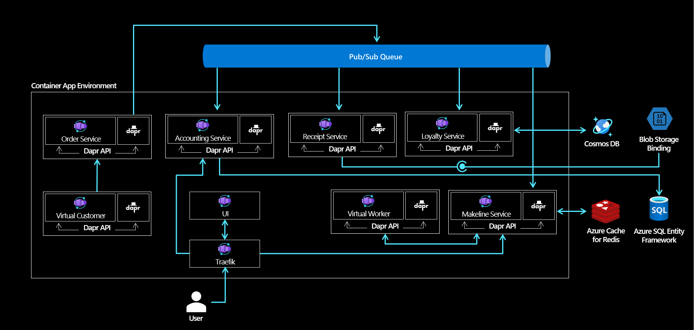

# Red Dog Demo - Container Apps Deployment

## Background

This repository leverages the [reddog applicaton codebase](https://github.com/Azure/reddog-code) and was created to help users deploy a comprehensive, microservice-based sample application to Azure Container Apps. 

[Azure Container Apps](https://azure.microsoft.com/en-us/services/container-apps/)* is a fully managed serverless container service for building and deploying modern apps at scale. It enables developers to deploy containerized apps without managing complex infrastructure. The reddog microservices were built using the Distributed Application Runtime (Dapr), which has built-in support via Azure Container Apps. In addition to Dapr support, Container Apps also provides a managed Kubernetes Event Driven Autoscaling (KEDA) experience. Through the abstraction of infrastructure management and the incorporation of open source technology, Azure Container Apps provides an ideal target for the deployment of the reddog application. If you are interested in how Azure Container Apps compares to other container hosting options in Azure, visit the Azure Container Apps [documentation](https://docs.microsoft.com/en-us/azure/container-apps/compare-options)

*Please note that Azure Container Apps is currently in Public Preview and therefore is not recommended for Production workloads

## Architecture

The architecture is comprised of a single Container Apps Environment that hosts ten respective Container Apps. While Dapr provides flexibility around the specific component implementations leveraged for the various building blocks, this demo is opinionated. There are also a few services that make use of KEDA scale rules. This repository leverages bicep templates in order to execute the deployment the Reddog applicaton and the supporting Azure Infrastructure. Bicep is a Domain Specific Language (DSL) for deploying Azure resources declaratively and provides a transparent abstraction over ARM and ARM templates.  

### Infrastructure Components

#### Resource Group
Deployed to hold all resources needed to deploy the above solution to Azure

#### Container App Environment 
The services in this solution are deployed to a single Container Apps environment, which acts as a secure boundary around groups of container apps

#### Azure Cosmos DB 
Microsoft's NoSQL multi-model managed database as a service offering which is used as the Dapr State Store component implementation for the Loyalty Service

#### Azure Cache for Redis 
A distributed, in-memory, scalable solution providing super-fast data access which is used as the Dapr State Store component implementation for the Makeline Service

#### Azure Service Bus 
A fully managed enterprise message broker with message queues and publish-subscribe topics used as the Dapr PubSub component implementation. This component is leveraged by multiple services, with the Order Service publishing messages to four other services in the application: Makelike, Accounting, Loyalty and Receipt

#### Azure SQL DB 
A member of the Azure SQL family, Azure SQL supports modern cloud applications on an intelligent, managed database service. This resource is created for the Accounting Service, which makes use of EF Core for interfacing with the DB. 

#### Azure Blob Storage 
Azuree Blob storage is optimized for storing massive amounts of unstructured data. Unstructured data is data that doesn't adhere to a particular data model or definition, such as text or binary data. Blob storage is used by the Receipt Service via Dapr Output Bindings to store order receipts.

### Container Apps 

For insight into the various microservices and their functionality, visit the Red Dog Demo [codebase repo](https://github.com/Azure/reddog-code). This repository, however, contains an additional component that is needed to get the solution up and running on the Container Apps platform. 
#### Traefik 
Traefik is a leading modern reverse proxy and load balancer that makes deploying microservices easy. Traefik integrates with your existing infrastructure components and configures itself automatically and dynamically. Container Apps currently makes use of Traefik's dynamic configuration feature in order to do path-based routing from the SPA UI as well as to enable direct calls via the rest samples

| Service          | Ingress |  Dapr Component(s) | KEDA Scale Rule(s) |
|------------------|---------|--------------------|--------------------|
| Traefik | Internal | Dapr not-enabled | n/a |
| UI | External | Dapr not-enabled | n/a |
| Order Service | Internal | PubSub: Azure Service Bus | n/a |
| Accounting Service | Internal | PubSub: Azure Service Bus | n/a |
| Receipt Service | Internal | PubSub: Azure Service Bus, Binding: Azure Blob | Azure Service Bus Topic Length |
| Loyalty Service | Internal | PubSub: Azure Service Bus, State: Azure Cosmos DB | Azure Service Bus Topic Length |
| Makeline Service | Internal | PubSub: Azure Service Bus, State: Azure Redis | Azure Service Bus Topic Length |
| Virtual Worker | Internal | Binding: Cron | n/a |
| Virtual Customer | n/a | n/a | n/a |

*A tenth service, Bootstrapper, will also be executed. However, this service is run once to perform EF Core Migration and is subsequently scaled to 0 after completing the necessary scaffolding.

## Getting Started

This repo contains the scripts and configurations to deploy the Red Dog Demo along with the backing Azure Resources. Simply clone the repo and execute the `run.sh` deployment script. Further details will be added soon.

## Contributing

This project welcomes contributions and suggestions.  Most contributions require you to agree to a
Contributor License Agreement (CLA) declaring that you have the right to, and actually do, grant us
the rights to use your contribution. For details, visit https://cla.opensource.microsoft.com.

When you submit a pull request, a CLA bot will automatically determine whether you need to provide
a CLA and decorate the PR appropriately (e.g., status check, comment). Simply follow the instructions
provided by the bot. You will only need to do this once across all repos using our CLA.

This project has adopted the [Microsoft Open Source Code of Conduct](https://opensource.microsoft.com/codeofconduct/).
For more information see the [Code of Conduct FAQ](https://opensource.microsoft.com/codeofconduct/faq/) or
contact [opencode@microsoft.com](mailto:opencode@microsoft.com) with any additional questions or comments.
